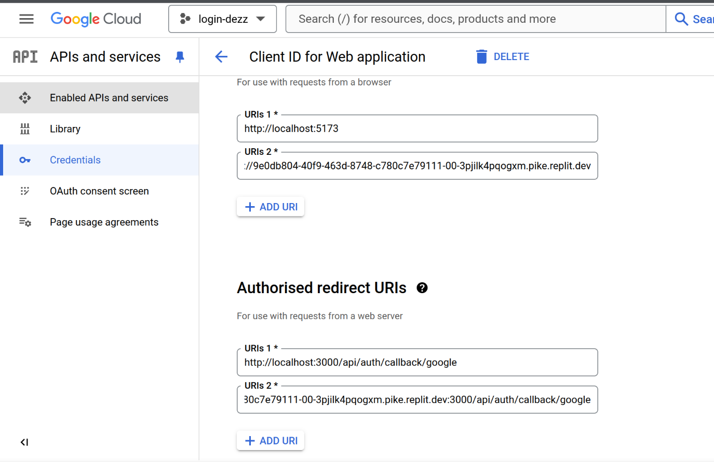
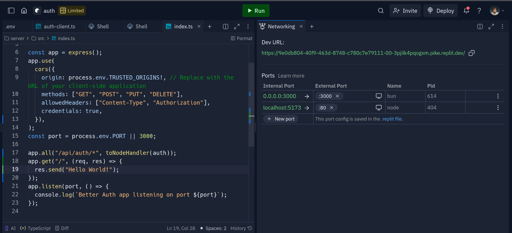

# Application Setup Guide

This guide will help you set up and run the application.

## Environment Setup

1. Navigate to the server directory and create your environment file:

   ```bash
   cd server
   cp .env.example .env
   ```

2. Configure the following environment variables in your `.env` file:

### Required Environment Variables

- `BETTER_AUTH_SECRET`: A secure random string for authentication

  ```
  BETTER_AUTH_SECRET=GV93enmUDpRj2AnrDvMvNeFgncQkmENT
  ```

- `BETTER_AUTH_URL`: Your server's base URL including port

  ```
  BETTER_AUTH_URL=http://localhost:3000
  ```

- `DATABASE_URL`: Your database connection string

  - Currently configured for Neon PostgreSQL
  - For other databases, install appropriate drivers following [Drizzle ORM documentation](https://orm.drizzle.team/docs/get-started)

- `TRUSTED_ORIGINS`: Your web application's URL

  ```
  TRUSTED_ORIGINS=http://localhost:5173
  ```

- `GOOGLE_CLIENT_ID` and `GOOGLE_CLIENT_SECRET`: Obtain from Google Cloud Console
  1. Go to Google Cloud Console
  2. Create a new project or select existing one
  3. Enable Google OAuth 2.0
  4. Create credentials and copy the ID and secret
  5. For the redirect URI, use `http://localhost:3000/api/auth/callback/google` you can see it on image 

### Optional Docker PostgreSQL Setup

If using Docker for PostgreSQL, configure these variables:

```
DB_HOST=localhost
DB_PORT=5432
DB_DATABASE=your_database
DB_USERNAME=your_username
DB_PASSWORD=your_password
```

Note: If using Docker, ensure you have the appropriate PostgreSQL driver configured in your Drizzle setup.

## Running the Application

1. Set up the database:

   ```bash
   # Generate migration files
   npx drizzle-kit generate

   # Apply migrations to your database
   npx drizzle-kit migrate
   ```

2. Install dependencies:

   ```bash
   # Using npm
   npm install
   # OR using bun
   bun install
   ```

3. Start the server:
   ```bash
   # Using node
   npm run dev
   # OR using bun
   bun dev
   ```

The application should now be running on the configured port (default: 3000).

// ... previous server setup content ...

## Web Application Setup

1. Navigate to the web directory and create your environment file:

   ```bash
   cd web
   cp .env.example .env
   ```

2. Configure the environment variable in your `.env` file:

   ```
   # If running on localhost
   VITE_AUTH_SERVER_URL=http://localhost:3000

   # If running on Replit (example)
   VITE_AUTH_SERVER_URL=https://your-replit-url:3000
   ```

   Note: If running both server and web app on the same Replit machine, use your Replit URL.

3. Install dependencies:

   ```bash
   # Using npm
   npm install
   # OR using bun
   bun install
   ```

4. Start the web application:
   ```bash
   # Using node
   npm run dev
   # OR using bun
   bun dev
   ```

The web application should now be running and connected to your authentication server.

## Replit Port Forwarding


